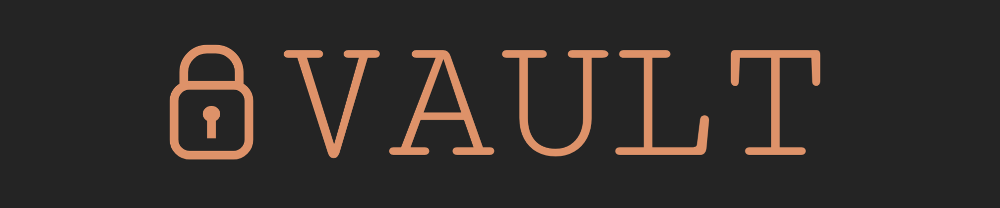

<hr>

A simple and lightweight vault for secret storage written in Rust.

## Why?
Because I like simple stuff with minimal BS.

## Usage
```sh
vault set {namespace}::kv::{path}
vault get {namespace}::kv::{path}
```

Password will be prompted securely for both the operations. For the `set` operation, the secret value will also be prompted.

Given password is used to encrypt the first secret for a given file and should be used for further operations on the same file.

Setting the secret of a path empty will remove the path from storage.

The encrypted secrets are written out to file(s) in the current working directory. The generated .vlt files are portable.

## Building from source
Rust needs to be installed ([link](https://www.rust-lang.org/tools/install)). In the project directory, run the following command -

```sh
cargo build --release
```

The generated executable can be found in `./targets/release`.

## Security considerations
Authenticated encryption is done using XChaCha20 and Poly1305 algorithms. The key size is 256 bits, so the maximum password length is 32 characters. Use a strong password to ensure maximum safety against dictionary attacks.

The inputs are never displayed or stored in the terminal, and the secret outputs are cleaned up on program end. However, if any secret is copied to clipboard, make sure it is cleaned after usage.

## Contributing
Feel free to raise issues and create PR if you feel something is missing or could be made better.
